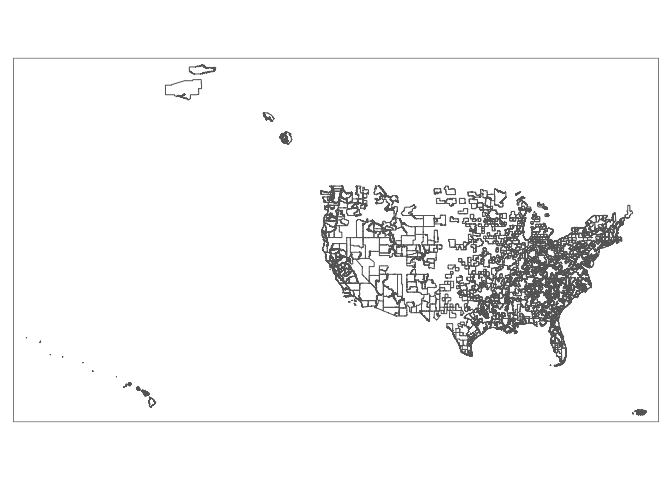

match\_address\_to\_metro
================
Sifan Liu
4/14/2022

## Introduction

Regional analysis often require matching addresses to a standard
geography. This tutorial shows how to retrieve the geography coordinates
(latitude and longitude) of the addresses, and use spatial joins to find
out if the addresses fall inside the target geographies.

## Required packages

``` r
library(dplyr)
library(tidygeocoder)
library(tigris)
library(sf)
library(tmap)
```

## Example: A list of address

Suppose we have a list of addresses, and we want to match the addresses
to US metropolitan areas.

``` r
(add <- tidygeocoder::sample_addresses)
```

    ## # A tibble: 9 × 2
    ##   name                 addr                                           
    ##   <chr>                <chr>                                          
    ## 1 White House          1600 Pennsylvania Ave NW Washington, DC        
    ## 2 Transamerica Pyramid 600 Montgomery St, San Francisco, CA 94111     
    ## 3 NY Stock Exchange    11 Wall Street, New York, New York             
    ## 4 Willis Tower         233 S Wacker Dr, Chicago, IL 60606             
    ## 5 Chateau Frontenac    1 Rue des Carrieres, Quebec, QC G1R 4P5, Canada
    ## 6 Nashville            Nashville, TN                                  
    ## 7 Nairobi              Nairobi, Kenya                                 
    ## 8 Istanbul             Istanbul, Turkey                               
    ## 9 Tokyo                Tokyo, Japan

## Geocoding

First, we use `tidygeocoder` package to perform batch geocoding. See
documentations here:
<https://jessecambon.github.io/tidygeocoder/articles/geocoder_services.html>

``` r
geocoded <- add %>% 
  tidygeocoder::geocode(address = addr, method = "arcgis")

geocoded
```

    ## # A tibble: 9 × 4
    ##   name                 addr                                           lat   long
    ##   <chr>                <chr>                                        <dbl>  <dbl>
    ## 1 White House          1600 Pennsylvania Ave NW Washington, DC      38.9   -77.0
    ## 2 Transamerica Pyramid 600 Montgomery St, San Francisco, CA 94111   37.8  -122. 
    ## 3 NY Stock Exchange    11 Wall Street, New York, New York           40.7   -74.0
    ## 4 Willis Tower         233 S Wacker Dr, Chicago, IL 60606           41.9   -87.6
    ## 5 Chateau Frontenac    1 Rue des Carrieres, Quebec, QC G1R 4P5, Ca… 46.8   -71.2
    ## 6 Nashville            Nashville, TN                                36.2   -86.8
    ## 7 Nairobi              Nairobi, Kenya                               -1.28   36.8
    ## 8 Istanbul             Istanbul, Turkey                             41.0    28.9
    ## 9 Tokyo                Tokyo, Japan                                 35.7   140.

## Shapefiles

Next, we retrieve shapefiles of the target geographies from US Census.
`tigris` package proivides shapefiles for counties, metro areas, states,
and many other census geographies.

``` r
cbsa_shapes <- tigris::core_based_statistical_areas(cb = T)
```

    ##   |                                                                              |                                                                      |   0%  |                                                                              |                                                                      |   1%  |                                                                              |=                                                                     |   1%  |                                                                              |=                                                                     |   2%  |                                                                              |==                                                                    |   2%  |                                                                              |==                                                                    |   3%  |                                                                              |===                                                                   |   4%  |                                                                              |===                                                                   |   5%  |                                                                              |====                                                                  |   5%  |                                                                              |====                                                                  |   6%  |                                                                              |=====                                                                 |   7%  |                                                                              |======                                                                |   8%  |                                                                              |======                                                                |   9%  |                                                                              |=======                                                               |  10%  |                                                                              |========                                                              |  12%  |                                                                              |=========                                                             |  12%  |                                                                              |=========                                                             |  13%  |                                                                              |=========                                                             |  14%  |                                                                              |==========                                                            |  14%  |                                                                              |==========                                                            |  15%  |                                                                              |===========                                                           |  16%  |                                                                              |=============                                                         |  19%  |                                                                              |==============                                                        |  20%  |                                                                              |===============                                                       |  21%  |                                                                              |===============                                                       |  22%  |                                                                              |================                                                      |  23%  |                                                                              |=================                                                     |  25%  |                                                                              |===================                                                   |  27%  |                                                                              |====================                                                  |  28%  |                                                                              |====================                                                  |  29%  |                                                                              |=====================                                                 |  29%  |                                                                              |=====================                                                 |  30%  |                                                                              |=======================                                               |  33%  |                                                                              |========================                                              |  34%  |                                                                              |========================                                              |  35%  |                                                                              |=========================                                             |  35%  |                                                                              |=========================                                             |  36%  |                                                                              |==========================                                            |  37%  |                                                                              |===========================                                           |  39%  |                                                                              |=============================                                         |  41%  |                                                                              |=============================                                         |  42%  |                                                                              |==============================                                        |  43%  |                                                                              |===============================                                       |  44%  |                                                                              |===============================                                       |  45%  |                                                                              |================================                                      |  45%  |                                                                              |================================                                      |  46%  |                                                                              |====================================                                  |  51%  |                                                                              |=====================================                                 |  53%  |                                                                              |======================================                                |  54%  |                                                                              |======================================                                |  55%  |                                                                              |=======================================                               |  55%  |                                                                              |=======================================                               |  56%  |                                                                              |========================================                              |  57%  |                                                                              |==========================================                            |  60%  |                                                                              |===========================================                           |  61%  |                                                                              |===========================================                           |  62%  |                                                                              |============================================                          |  62%  |                                                                              |============================================                          |  63%  |                                                                              |=============================================                         |  64%  |                                                                              |==============================================                        |  65%  |                                                                              |===============================================                       |  68%  |                                                                              |================================================                      |  69%  |                                                                              |=================================================                     |  69%  |                                                                              |=================================================                     |  70%  |                                                                              |====================================================                  |  74%  |                                                                              |====================================================                  |  75%  |                                                                              |=====================================================                 |  76%  |                                                                              |========================================================              |  80%  |                                                                              |=========================================================             |  81%  |                                                                              |==========================================================            |  82%  |                                                                              |==========================================================            |  83%  |                                                                              |===========================================================           |  84%  |                                                                              |===========================================================           |  85%  |                                                                              |============================================================          |  85%  |                                                                              |============================================================          |  86%  |                                                                              |=================================================================     |  93%  |                                                                              |===================================================================== |  99%  |                                                                              |======================================================================| 100%

``` r
# how the shapes look like on a map
tm_shape(cbsa_shapes)+
  tm_borders()
```

<!-- -->

## Spatial Joins

To perfrom spatial joins, we first need to convert the lat long columns
from character value to a spatial object with `sf::st_as_sf` function.
Make sure to use the same Coordinate Reference Systems (CRS) as the
shapefiles.

Finally, we use `sf::st_intersection` function to figure out if any
address **points** falls into the metro **shapes**. The output shows the
final matching result.

``` r
geocoded %>% 
  select(name, addr, lat, long) %>% 
  st_as_sf(coords = c("long", "lat"), crs = st_crs(cbsa_shapes)) %>% 
  st_intersection(cbsa_shapes) %>% 
  st_drop_geometry() %>% 
  select(name, addr, cbsa_code = GEOID)
```

    ## # A tibble: 5 × 3
    ##   name                 addr                                       cbsa_code
    ##   <chr>                <chr>                                      <chr>    
    ## 1 White House          1600 Pennsylvania Ave NW Washington, DC    47900    
    ## 2 NY Stock Exchange    11 Wall Street, New York, New York         35620    
    ## 3 Willis Tower         233 S Wacker Dr, Chicago, IL 60606         16980    
    ## 4 Transamerica Pyramid 600 Montgomery St, San Francisco, CA 94111 41860    
    ## 5 Nashville            Nashville, TN                              34980
